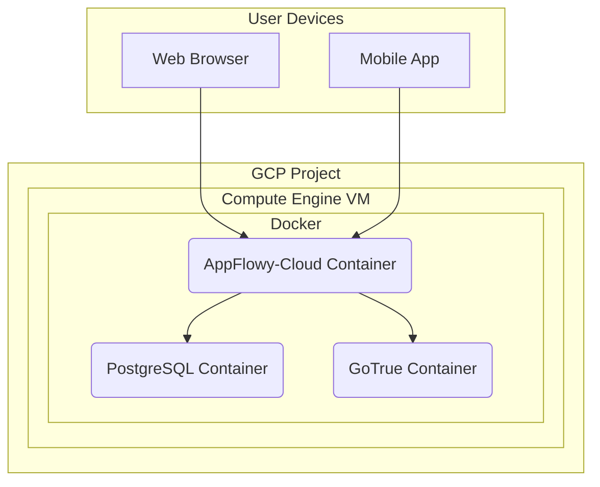

# Technical Specification: AppFlowy-Studios MVP

## Document Information
| Field | Details |
|-------|---------|
| **Status** | Draft |
| **Author** | Gemini |
| **PRD Reference** | [PRD](./prd.md) |
| **Created** | 2025-08-24 |
| **Last Updated** | 2025-08-24 |

## Overview

### Purpose
This document provides the technical specification for the AppFlowy-Studios MVP. It outlines the simplified, Docker Compose-based architecture and implementation details.

### Scope
**In Scope:**
- Self-hosting the official `AppFlowy-Cloud` service on a GCP Compute Engine VM.
- Configuring the built-in authentication service (GoTrue) to handle Google Workspace sign-in.

**Out of Scope:**
- Building the core AppFlowy backend from source.
- A multi-server, high-availability setup (future consideration).
- A command-line tool for file synchronization.

## System Architecture

### High-Level Design

### Component Breakdown
| Component | Responsibility | Technology |
|-----------|---------------|------------|
| **AppFlowy-Cloud** | Official, pre-built container for core AppFlowy backend logic. | Docker Image |
| **PostgreSQL** | Data storage for AppFlowy, running as a container. | Docker Image (PostgreSQL) |
| **GoTrue** | Built-in service to handle Google Workspace OAuth and issue JWTs. | Docker Image |
| **Compute Engine** | A single virtual machine to host the Docker environment. | GCP |
| **Docker Compose** | Tool to define and run the multi-container application. | Docker |

## Data Design

### Data Models
We will use the default data models and schema provided by the official AppFlowy-Cloud and its PostgreSQL database.

### Data Flow
1. A user attempts to access the AppFlowy service.
2. They are directed to the **GoTrue** service to sign in with their Google Workspace account.
3. GoTrue validates the user and returns a JWT to the client.
4. The client (web, mobile) makes requests to the **AppFlowy-Cloud** service, presenting the JWT.
5. AppFlowy-Cloud processes the request, interacting with the **PostgreSQL** container for all data.

## API Design

All APIs are the internal APIs provided by the AppFlowy-Cloud service. There is no custom API.

## Deployment Plan

### Infrastructure Requirements
- A GCP project.
- A single GCP Compute Engine VM instance (e.g., `e2-medium`).
- A firewall rule to allow HTTP/S traffic.

### Deployment Steps
1.  Use Terraform to provision the Compute Engine VM.
2.  The VM's startup script will install Docker and Docker Compose.
3.  A `docker-compose.yml` file will be placed on the VM.
4.  This file will define three services: `appflowy-cloud`, `postgres`, and `gotrue`.
5.  A `.env` file will be created on the VM with the necessary configuration for the Google authentication provider.
6.  Run `docker compose up -d` to start the entire application stack.
7.  Configure DNS to point `workspace.42galaxies.studio` to the VM's IP address.
